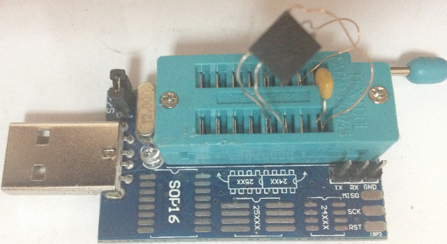

# AT17Fxxx programming tools
This tools is to read/program AT17Fxxx(A) flash-based EEPROM chips by linux i2c bus.

This programs are for reading/writing Atmel/Microchip AT17Fxxx(A) flash-based EEPROM's that often used as replacement for configuration PROM's for Altera/Xilinx FPGA's.

To read/write You need to connect eeprom chip to your linux machine's i2c bus. If You have CH341A programmer, You can use it as well by using [i2c-ch341-usb](https://github.com/gschorcht/i2c-ch341-usb.git) kernel module, so any chips, connected to thsi programmer will be seen by i2cdetect app.

By default /dev/i2c-8 bus is used, You can change bus name in Makefile

Here is sample of connecting AT17F040A to ch341a-based programmer:


Pinouts:

Pin name|AT17FxxxA pin|24XX pin
-- | -- | --
SDA|1|5
SCL|2|6
!RESET/OE|3| 
nCS|4| 
GND|5|4
(A2)/nCAS|6| 
!SER_EN|7|4
VCC|8|8
||

# Building
Make sure that You have linux headers installed and GCC compiler. And just run "make" to compile executables.

# Reading from AT17F040A example
```./flash_dump random_readed.bin 
ID[4]: 1ea300a3
This flash is for ALTERA FPGAs
Found 4 mbit flash
Reading EEPROM contents...
................................................................: 12%
[CUTTED]
................................................................: 100%
Flash readed successfully!
```
After that, You will have "random_readed.bin" binary file with contents of chip.

# Writing to AT17F040A example
Before writing, make sure You have binary file to program, in this example we will program "random.bin" file.
```./flash_prog random.bin 
ID[4]: 1ea300a3
This flash is for ALTERA FPGAs
Found 4 mbit flash
All flash contents will be ERASED, Are You sure? [y/N] y

Erasing in-progess...
................................................................
................................................................
...............
Writing to EEPROM...
................................................................: 1%
[CUTTED]
................................................................: 100%
Flash written successfully!
```
